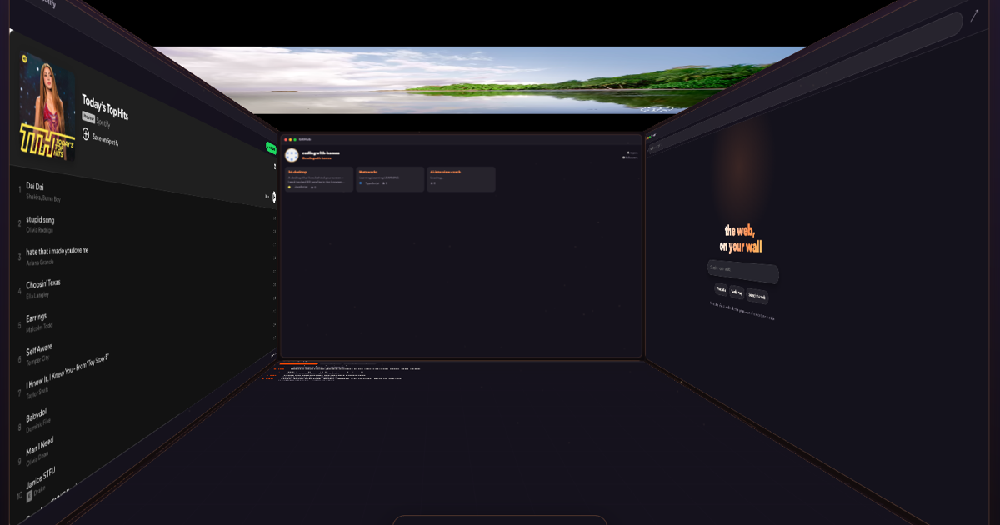

# 3D Desktop

**Your screen is a window, not a wall.**

A browser-based 3D room where app windows cover the walls — and the whole scene
shifts perspective in real time based on where your head is, tracked through
your webcam. Lean in and you *fly into the room*. It's the glasses-free-3D /
"looking through a window" illusion, running at your display's native refresh
rate.



**Live demo:** https://codingwith-hamza.github.io/3d-desktop/

## What's inside the room

| Wall | App |
|---|---|
| Left | **Spotify** — official player; supports real OAuth login with your playlists (see setup below) |
| Right | **Browser** — real address bar, live Bing search results in-frame, Wikipedia/map quick links |
| Back | **GitHub** — live profile and top repos from the public API |
| Ceiling | **YouTube** — official player, paste any link |
| Floor | **Reddit** — reader with subreddit tabs |
| Dock | Open/close any screen; a closed wall goes bare |

## Controls

- **Move your head** — the room's perspective follows (webcam, all in-browser)
- **Lean in / out** — fly into the room and back
- **Mouse + scroll wheel** — blends with head motion; full fallback if the camera is denied
- **Green light / double-click titlebar** — maximize a window onto its wall
- **Red light** — close a screen · **dock** reopens it
- **R** — recenter your resting pose · **Esc** — float all windows

## Privacy

The webcam feed goes straight into an on-device MediaPipe face landmarker
(WASM, running in a Web Worker). One nose coordinate and an eye-span number
come out. **No video is recorded, stored, or sent anywhere.**

## Tech

- [Three.js](https://threejs.org) — WebGL room + CSS3D app panels sharing one camera
- Off-axis ("portal") projection pinned to the viewport at rest, morphing into free flight
- [MediaPipe Face Landmarker](https://developers.google.com/mediapipe) — self-hosted WASM + model, lazy-loaded, worker-threaded
- Vite, vanilla JS, no framework

```bash
npm install
npm run dev     # local dev (camera works on localhost)
npm run build   # static build in dist/
```

## Spotify login (optional, for the full experience)

1. Create a free app at [developer.spotify.com/dashboard](https://developer.spotify.com/dashboard)
2. Add redirect URIs: `http://localhost:5173/` and your deployed URL (trailing slash)
3. Paste the Client ID into `src/config.js`

Without it, the Spotify wall shows the official embed player — nothing breaks.

---

Built with [Claude Code](https://claude.com/claude-code).
